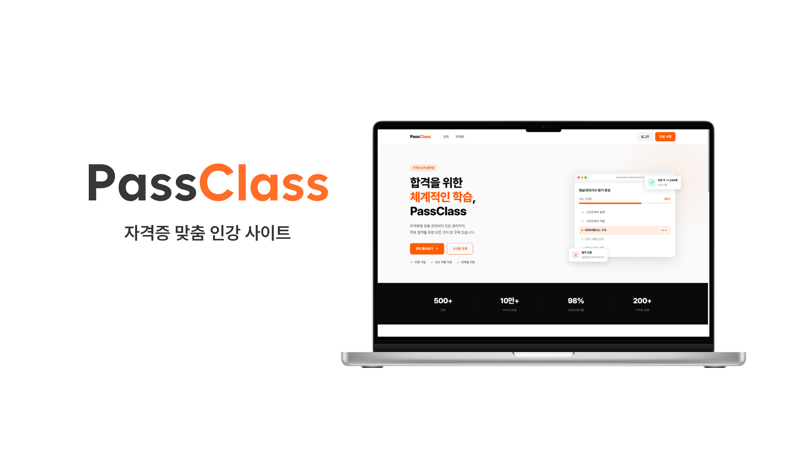

# PassClass — Backend

자격증 시험을 준비하는 학습자를 위한 온라인 인강 플랫폼 **PassClass**의 백엔드 서버입니다.
강의 수강, 문제 풀이, 모의고사, 오답노트까지 하나의 서비스에서 제공합니다.

프론트엔드와 분리된 REST API 서버로 동작하며, Spring Boot 기반으로 구축되었습니다.

---

## 개발 동기

2026년 응용프로그래밍 개발 수업의 개인 프로젝트입니다. 학교에서 **Claude AI**를 지원받아, AI를 적극 활용하여 프로젝트를 완성하는 것이 과제의 핵심이었습니다.

과제의 공통 주제는 **인강 사이트**였으며, 어떤 종류의 인강 사이트를 만들지는 각자 선택하는 방식이었습니다. 평소 자격증 시험을 준비하면서 관련 인강을 자주 찾아보던 경험을 살려, 자격증 학습에 특화된 인강 플랫폼 **PassClass**를 기획하게 되었습니다.

P1 → P2 → P3 단계적으로 기능을 확장하며, 기초적인 CRUD부터 인증·권한 관리, 알림·결제·보안까지 점진적으로 발전시키는 것을 목표로 합니다.

---

## 개발 히스토리

| 단계 | 내용 |
|------|------|
| P1 | 인증 없이 수강생 관점의 기본 기능 구현. 백엔드 + 프론트엔드 분리, DBMS 연동 |
| P2 | JWT 인증 도입, 역할 기반 접근 제어(수강생 / 강사 / 관리자) 구현. AWS EC2 + Vercel 배포 |
| P3 | 이메일·디스코드 구독 알림, 스케줄러, Webhook, 모니터링, 보안(SQL 인젝션·XSS), 결제 모듈, 성능 최적화 예정 |

---

## 기술 스택

| 기술 | 용도 |
|------|------|
| Java 21 | 메인 언어 |
| Spring Boot 3.5.11 | 애플리케이션 프레임워크 |
| Spring Security + JWT | 인증 및 권한 관리 |
| Spring Data JPA | ORM, 데이터베이스 연동 |
| MySQL 8.0 | 관계형 데이터베이스 |
| Firebase Admin SDK | 파일 저장소 (이미지, 영상 URL) |
| Gradle | 빌드 도구 |
| Swagger (springdoc 2.3) | API 문서 자동화 |
| Docker | 컨테이너 배포 |
| AWS EC2 | 서버 호스팅 |

---

## 주요 기능

- **회원 관리** — 회원가입, 로그인/로그아웃, 자동 로그인, 프로필 수정
- **강의** — 강의 목록·상세 조회, 카테고리·정렬 필터, 강의 찜(좋아요), 리뷰 및 평점
- **수강 관리** — 수강 신청·취소, 챕터별 영상 시청, 진도율 저장, 수강 완료 처리
- **문제 풀이** — 자격증별 문제 목록·상세 조회, 풀이 제출, 정답·해설 확인
- **모의고사** — 모의고사 목록·응시·제출, 점수 및 결과 조회
- **오답노트** — 틀린 문제 자동 저장, 목록 조회, 개별 삭제
- **Q&A** — 강의별 질문 등록, 강사 답변
- **알림** — 알림 목록 조회, 읽음 처리, 안 읽은 알림 수 표시
- **강사 기능** — 강의·챕터·문제·모의고사 등록 및 관리
- **관리자 기능** — 자격증·사용자 관리, 전체 콘텐츠 관리
- **파일 업로드** — 강의 썸네일, 프로필 이미지 (Firebase Storage 연동)

---

## 시작하기

### 사전 요구사항

- Java 21 이상
- MySQL 8.0 이상
- Firebase 프로젝트 및 서비스 계정 키 파일

### 환경 설정

`src/main/resources/application.properties`에서 아래 값을 환경에 맞게 수정하세요.

```properties
# 데이터베이스
spring.datasource.url=jdbc:mysql://localhost:3306/passclass
spring.datasource.username=root
spring.datasource.password=YOUR_PASSWORD

# JWT 시크릿 키
spring.jwt.secret=YOUR_SECRET_KEY

# Firebase
firebase.configuration-file=firebase/YOUR_SERVICE_ACCOUNT.json
firebase.bucket=YOUR_BUCKET.firebasestorage.app
```

### 실행

```bash
# 빌드
./gradlew build

# 실행
./gradlew bootRun
```

서버는 기본적으로 `http://localhost:8009`에서 실행됩니다.

### Docker로 실행

```bash
docker build -t passclass-backend .
docker run -p 8009:8009 passclass-backend
```

---

## API 문서

서버 실행 후 Swagger UI에서 전체 API 명세를 확인할 수 있습니다.

```
http://localhost:8009/swagger-ui/index.html
```

---

## API 연동 목록

| 기능 | 메서드 | 엔드포인트 |
|------|--------|-----------|
| 회원가입 | POST | `/api/auth/signup` |
| 로그인 | POST | `/api/auth/login` |
| 로그아웃 | POST | `/api/auth/log-out` |
| 자동 로그인 | POST | `/api/auth/auto-login` |
| 내 프로필 조회 | GET | `/api/user/profile/me` |
| 프로필 수정 | PATCH | `/api/user/profile/me` |
| 자격증 목록 | GET | `/api/certificates` |
| 강의 목록 | GET | `/api/lecture` |
| 강의 상세 | GET | `/api/lecture/{lectureId}` |
| 강의 등록 | POST | `/api/lecture` |
| 챕터 목록 | GET | `/api/lecture/chapters` |
| 챕터 시청 | GET | `/api/lecture/chapters/{chapterId}/watch` |
| 진도율 저장 | PATCH | `/api/lecture/chapters/{chapterId}/progress` |
| 수강 신청 | POST | `/api/enrollment/{lectureId}` |
| 리뷰 작성 | POST | `/api/reviews` |
| 강의 좋아요 | POST | `/api/lectures/{lectureId}/like` |
| 문제 목록 | GET | `/api/problems` |
| 문제 풀이 제출 | POST | `/api/problems/{problemId}/solve` |
| 모의고사 목록 | GET | `/api/mock-exams` |
| 모의고사 제출 | POST | `/api/mock-exams/{mockExamId}/submit` |
| 오답노트 목록 | GET | `/api/wrong-notes` |
| Q&A 질문 | POST | `/api/lectures/{lectureId}/questions` |
| 알림 목록 | GET | `/api/notifications` |
| 파일 업로드 | POST | `/api/files` |

---

## 역할 및 접근 권한

| 기능 | STUDENT | TEACHER | ADMIN |
|------|:-------:|:-------:|:-----:|
| 강의 생성 | | ✓ | ✓ |
| 강의 수정·삭제 | | | ✓ |
| 자격증 관리 | | | ✓ |
| 챕터·문제·모의고사 관리 | | ✓ | ✓ |
| 수강 신청·리뷰·질문 | ✓ | ✓ | ✓ |
| 리뷰 답글·질문 답변 | | ✓ | ✓ |

JWT 액세스 토큰은 요청 헤더의 `Authorization: Bearer <token>` 형식으로 전달됩니다.

---

## 프로젝트 구조

```
src/main/java/app_programming_development/Class/
├── auth/           # 인증 (JWT 발급·검증, 리프레시 토큰)
├── user/           # 사용자 관리
├── lecture/        # 강의 관리
├── chapter/        # 챕터 관리 및 시청 진도
├── certificate/    # 자격증 관리
├── enrollment/     # 수강 신청
├── problem/        # 문제 풀이 및 오답노트
├── mockexam/       # 모의고사
├── review/         # 강의 리뷰
├── question/       # 강의 Q&A
├── like/           # 강의 찜
├── notification/   # 알림
├── file/           # 파일 업로드 (Firebase)
├── config/         # Security, Firebase, Swagger 설정
├── global/         # 공통 응답 형식, JWT 유틸
├── security/       # JWT 필터, UserDetailsService
└── exceptions/     # 도메인 예외 처리
```

---

## 배포

| 환경 | 플랫폼 | 비고 |
|------|--------|------|
| 프론트엔드 | Vercel | GitHub 연동 자동 배포 |
| 백엔드 | AWS EC2 (Linux) | Spring Boot JAR 실행 |
| 데이터베이스 | AWS EC2 (Linux) | MySQL |

백엔드 서버의 기본 포트는 **8009**입니다. 프론트엔드의 `VITE_API_BASE_URL`을 EC2 백엔드 주소로 설정해야 합니다.
